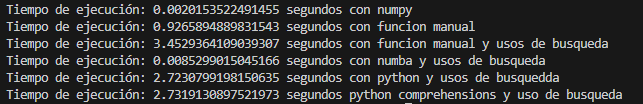

# reduccion_de_recursos_calculo_matrix
Reduccion de recursos al calcular matrices, con el uso de matrix tablas de multiplicar para ahorrar el calculo de multiplicacion, disminucion de los tiempos de ejecucion con tecnicas de numba. "posible prueba en C y Fortran" para disminuir aun mas los tiempo de calculo.

